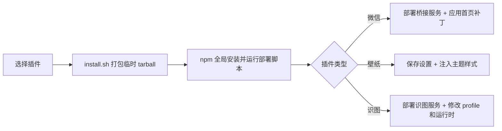

<div align="center">

# DSH Plugins 4U

**让 DeepSeek Harness 连接微信、拥有个性壁纸，也能读懂图片。**

一个面向 macOS 的 DSH 扩展集合。三个功能独立封装、按需安装，DSH 升级后也可以一键重新应用。

[](#运行要求)
[](#插件一览)
[](#运行要求)

[快速安装](#快速安装) · [插件一览](#插件一览) · [首次使用](#首次使用) · [维护与升级](#维护与升级)

</div>

> [!IMPORTANT]
> 这不是 DeepSeek Harness 官方插件。由于 DSH 暂未为会话首页、主题背景和图片受理链路开放完整扩展点，本项目会修改本机 DSH 的运行时文件或客户端 bundle。安装脚本可重复执行；DSH 升级后通常需要重新应用。

## 插件一览

| 插件 | 用来做什么 | 使用入口 | 安装后的额外操作 |
| --- | --- | --- | --- |
| **微信**<br>`@dsh-plugins/wechat` | 在手机微信与 DSH 之间收发消息、图片和文件；在 DSH 首页加入微信会话入口 | 微信 / DSH 首页 | 首次使用扫码登录 |
| **壁纸**<br>`@dsh-plugins/wallpaper` | 使用内置预设或本地图片更换 DSH 背景，可调透明度 | `dsh-plugins-wallpaper` | 无 |
| **识图**<br>`@dsh-plugins/vision` | 让 agent 分析粘贴或拖入的图片，支持图片描述与 OCR | DSH 对话框 | 配置 API Key，并重启 DSH |

三个插件彼此独立。你可以全部安装，也可以只选择需要的功能。

## 快速安装

### 安装全部插件

```bash
git clone https://github.com/honghudavy-star/DSH_plugins_4U.git
cd DSH_plugins_4U
./install.sh
```

### 按需安装

```bash
# 只安装一个
./install.sh wechat

# 也可以一次选择多个
./install.sh wallpaper vision
```

可用名称为 `wechat`、`wallpaper` 和 `vision`。

> [!NOTE]
> 请使用仓库提供的 `install.sh`。直接执行 `npm install --global ./packages/<name>` 时，npm 会链接本地目录，不能可靠触发插件的部署流程。

## 运行要求

- macOS
- Node.js 与 npm
- 已安装并能正常启动 DeepSeek Harness
- 使用微信插件时，DSH Web 服务默认需要运行在 `http://127.0.0.1:3080`
- 使用识图插件时，需要一个 SiliconFlow API Key

安装脚本会先将所选插件打包为临时 npm tarball，再通过 `npm install --global --foreground-scripts` 安装并执行部署脚本。临时文件会在安装结束后自动清理。

## 首次使用

### 微信

安装完成后，桥接服务会交给 macOS `launchd` 托管。第一次使用需要查看日志中的二维码并用手机微信扫码：

```bash
tail -f ~/.dsh-wechat/bridge.out.log
```

扫码后，在微信中发送一条消息。桥接器会创建或复用 DSH 的微信会话，agent 的回复会自动返回微信；同一段对话也会显示在 DSH Web 界面中。

常用维护命令：

```bash
# 重启桥接服务
launchctl kickstart -k gui/$(id -u)/com.dsh.wechatbridge

# 查看错误日志
tail -f ~/.dsh-wechat/bridge.err.log
```

[查看微信插件的完整说明](packages/wechat/README.md)

### 壁纸

安装时会应用默认的 `midnight` 壁纸。之后可以通过命令行切换预设、使用自己的图片或关闭壁纸：

```bash
# 查看内置预设
dsh-plugins-wallpaper list

# 切换预设
dsh-plugins-wallpaper set aurora

# 使用本地图片
dsh-plugins-wallpaper set ~/Pictures/background.jpg

# 设置透明度，范围为 0–1
dsh-plugins-wallpaper set forest --opacity 0.5

# 查看状态或关闭壁纸
dsh-plugins-wallpaper status
dsh-plugins-wallpaper off
```

DSH 运行中时，修改通常会通过 HMR 自动更新；如果页面没有变化，刷新浏览器即可。

<table>
  <tr>
    <td align="center"><br><sub>midnight</sub></td>
    <td align="center"><br><sub>aurora</sub></td>
    <td align="center"><br><sub>forest</sub></td>
    <td align="center"><br><sub>sunset</sub></td>
  </tr>
</table>

[查看壁纸插件的完整说明](packages/wallpaper/README.md)

### 识图

安装前可以先通过环境变量提供 API Key：

```bash
export SILICONFLOW_API_KEY="your-api-key"
./install.sh vision
```

如果没有设置环境变量，安装过程会交互式询问。配置完成后需要停止当前 DSH Web 进程并重新启动：

```bash
npm exec @deepseek-ai/dsh web
```

重启后，在 DSH 对话框中粘贴或拖入图片。agent 会通过 `image_understand` 工具读取图片，再根据你的问题进行描述、分析或 OCR。

> [!CAUTION]
> API Key 会写入本机的 DSH profile 配置。请勿将 `~/.dsh/profiles/web/cordis.patch.yml` 上传、分享或提交到 Git。

[查看识图插件的完整说明](packages/vision/README.md)

## 它是如何工作的



当前 DSH 插件系统没有覆盖本项目所需的全部界面与消息链路，因此三个包会将可重放的补丁部署到本机：

- **微信**：部署桥接进程，生成 `launchd` 配置，并为首页会话列表应用入口补丁。
- **壁纸**：将压缩后的图片内嵌到主题样式中，并把设置保存在 `~/.dsh-plugins/wallpaper/`。
- **识图**：部署本地 `luma-mcp` 服务，应用图片消息链路补丁，并更新 DSH Web profile。

这些操作都以“可重复执行”为设计目标，但它们仍然依赖 DSH 当前的 bundle 和运行时结构。DSH 大版本升级后，如果补丁无法匹配，请先查看安装输出，不要继续假设功能已经生效。

## 维护与升级

DSH 重装、升级或重建 npm exec 缓存后，可以重新运行总安装脚本：

```bash
./install.sh
```

也可以只重新应用某一个插件：

```bash
dsh-plugins-wechat
dsh-plugins-wallpaper apply
dsh-plugins-vision
```

识图插件重新应用后仍需重启 DSH。壁纸插件通常不需要重启；微信桥接服务已经运行时，安装器会保留当前服务，可按需使用前面的 `launchctl kickstart` 命令重启。

## 数据与安全边界

- 仓库不应包含微信登录凭据或第三方 API Key。
- 微信运行数据与日志保存在 `~/.dsh-wechat/`。
- 壁纸设置保存在 `~/.dsh-plugins/wallpaper/`。
- 识图 API Key 保存在 `~/.dsh/profiles/web/cordis.patch.yml`。
- 插件会修改 DSH 的本地缓存、profile 或客户端 bundle；执行前请确认你理解这些变更。

## 项目结构

```text
DSH_plugins_4U/
├── install.sh                  # 统一安装入口
└── packages/
    ├── wechat/
    │   ├── install.mjs         # 部署桥接服务并应用首页补丁
    │   ├── src/                # 微信 ↔ DSH 桥接器
    │   └── ui/                 # DSH 首页微信入口补丁
    ├── wallpaper/
    │   ├── wallpaper.mjs       # 壁纸 CLI 与部署逻辑
    │   └── presets/            # 四张内置壁纸
    └── vision/
        ├── install.mjs         # 识图插件安装入口
        ├── apply-patches.mjs   # DSH 运行时补丁
        ├── patch-profile.mjs   # DSH profile 配置
        └── luma-mcp/           # 本地识图服务
```

## 常见问题

<details>
<summary><strong>DSH 升级后插件失效了怎么办？</strong></summary>
<br>
重新运行 <code>./install.sh</code>，或只重新应用受影响的插件。识图插件完成后需要重启 DSH。
</details>

<details>
<summary><strong>安装脚本可以重复运行吗？</strong></summary>
<br>
可以。部署脚本按幂等方式编写；如果 DSH 的内部文件结构发生变化，安装器会输出无法匹配的补丁位置，此时应根据日志检查兼容性。
</details>

<details>
<summary><strong>微信插件为什么收不到消息？</strong></summary>
<br>
先确认 DSH Web 服务正在运行，再查看 <code>~/.dsh-wechat/bridge.out.log</code> 和 <code>bridge.err.log</code>。如有需要，重启 launchd 服务。
</details>

<details>
<summary><strong>为什么识图安装后没有生效？</strong></summary>
<br>
确认 SiliconFlow API Key 已写入 profile，并完整停止、重新启动 DSH Web 进程。仅刷新浏览器不足以加载运行时补丁和新配置。
</details>

---

<div align="center">
  <sub>Built for people who want to keep their DSH setup reproducible.</sub>
</div>
